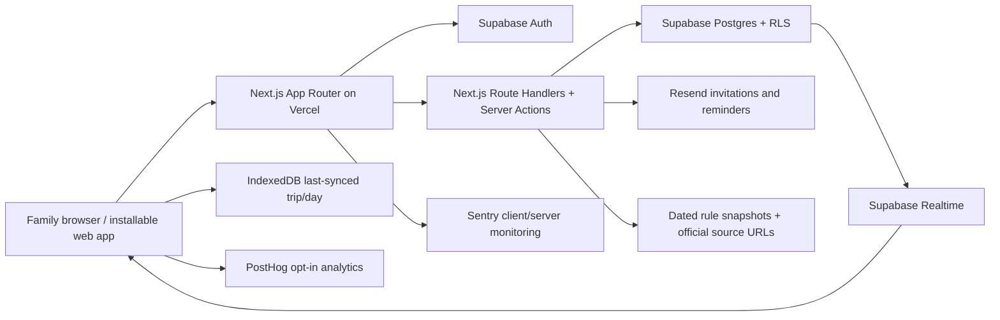

# PRD — WDW Planner

## 1. Overview

### Product Summary

WDW Planner is a rule-aware, collaborative itinerary for families coordinating every day, booking window, meal credit, nap, and attraction in a Walt Disney World vacation. It imports an existing spreadsheet or normalized JSON plan, presents it as a desktop day rail plus chronological timelines, and surfaces dated, sourced conflicts without erasing the family's original choices. The responsive mobile view is optimized for executing the selected day in bright, crowded, intermittently connected conditions.

### Objective

This PRD specifies the 4–8 week private MVP defined in `docs/product-vision.md § MVP Definition`: import and review, trip/day/event editing, dated rule conflicts, dining and Lightning Lane planning, family roles, auditability, and responsive last-synced execution. The September 16–26, 2026 fixture in `data/trip-2026.json` is the primary end-to-end acceptance case.

### Market Differentiation

The implementation must connect domain reasoning to the family's complete itinerary. A warning is not a generic article or global banner; it references an affected day or event, states its applicability dates, records when it was verified, links to a source, and offers a resolution. The product must retain non-park travel, DVC lodging, naps, subgroup stays, and uncertain plans rather than reducing the trip to attraction optimization.

### Magic Moment

Within five minutes of first sign-in, the owner can upload the supported CSV, review its mapping, and open an eleven-day itinerary that contains at least one correct actionable conflict. For the canonical fixture, import must reliably identify the published water-park eligibility mismatch, Space 220 dining-plan incompatibility, and EPCOT Group 1 initial-selection conflict. This path must feel safe: raw source data is retained, no unsupported field is silently discarded, and the owner can trace every finding.

### Success Criteria

- The canonical CSV/JSON fixture imports with all 11 days, both stays, flights, tickets, meal choices, nap blocks, grandparents' lodging, and Lightning Lane wishes represented.
- Known-fixture conflict tests produce the expected five conflict records with no P0 false negatives.
- Median supported-fixture import-to-overview time is under two minutes; p95 server mutation time is under 500ms at private-MVP scale.
- Owner, editor, and viewer RLS policies prevent all unauthorized cross-trip reads/writes in automated tests.
- Desktop works at 1280px and above; mobile works from 360–430px with 44px minimum targets and WCAG 2.1 AA text contrast.
- The last successfully synced selected trip/day opens from IndexedDB when the network is unavailable and is visibly marked read-only with a timestamp.
- All P0 requirements pass unit/integration tests and the canonical Playwright journey.

## 2. Technical Architecture

### Architecture Overview



The browser uses authenticated Server Actions and Route Handlers for all writes and import processing. Supabase remains the system of record and enforces authorization through RLS even if application checks fail. Realtime invalidates or patches active-trip queries. A small IndexedDB cache stores only the user's last opened trip/day and sync metadata; offline mode is read-only in the MVP.

### Chosen Stack

| Layer          | Choice                                           | Rationale                                                                                                |
| -------------- | ------------------------------------------------ | -------------------------------------------------------------------------------------------------------- |
| Frontend       | Next.js App Router + React + TypeScript          | Responsive installable web app, server rendering, and strong coding-agent support                        |
| Backend        | Next.js Route Handlers/Server Actions + Supabase | Authenticated CRUD and import orchestration with a small operational footprint                           |
| Database       | Supabase Postgres                                | Relational trip constraints, SQL aggregation, auditability, and RLS                                      |
| Auth           | Supabase Auth magic links                        | Low-friction family invitations without application-managed passwords                                    |
| Analytics      | PostHog, opt-in                                  | Measure import, conflict resolution, and sharing while allowing private deployments to disable analytics |
| Email          | Resend                                           | Trip invitations and booking-window reminders                                                            |
| Error tracking | Sentry                                           | Detect import, synchronization, and production failures before the family relies on the plan             |
| Hosting        | Vercel + Supabase Cloud                          | Lowest-friction deployment for the selected stack                                                        |

Payments are intentionally absent because the private MVP is free.

### Stack Integration Guide

1. Scaffold Next.js with TypeScript, App Router, ESLint, Tailwind CSS, and `src/` layout. Install Supabase SSR helpers before building auth.
2. Create separate Supabase development and production projects. Apply SQL migrations through the Supabase CLI; never edit production schema only through the dashboard.
3. Implement `src/lib/supabase/server.ts`, `client.ts`, and `middleware.ts` using `@supabase/ssr`. Refresh sessions in middleware and never trust a browser-supplied user ID.
4. Generate database TypeScript types after each migration and commit `src/types/database.ts`.
5. Keep importer parsing pure in `src/lib/import/`; Route Handlers validate files, invoke the parser, persist an immutable import record, and return a review payload before commit.
6. Use Zod schemas at every input boundary. Postgres constraints and RLS are the final authority.
7. Use TanStack Query for client mutation state and realtime invalidation. Persist only a sanitized selected-trip snapshot to IndexedDB with `idb-keyval`; do not cache private confirmation codes unless explicitly enabled.
8. Initialize Sentry in client, server, and edge configs with PII scrubbing. Initialize PostHog only after consent and omit it entirely when `NEXT_PUBLIC_ANALYTICS_ENABLED=false`.
9. Send email through server-only Resend code. Invitations use single-use application tokens stored as hashes; authentication still completes through Supabase magic link.

Required environment variables:

```text
NEXT_PUBLIC_APP_URL
NEXT_PUBLIC_SUPABASE_URL
NEXT_PUBLIC_SUPABASE_ANON_KEY
SUPABASE_SERVICE_ROLE_KEY
RESEND_API_KEY
RESEND_FROM_EMAIL
SENTRY_DSN
SENTRY_AUTH_TOKEN
NEXT_PUBLIC_POSTHOG_KEY
NEXT_PUBLIC_POSTHOG_HOST
NEXT_PUBLIC_ANALYTICS_ENABLED
RULE_REFRESH_SECRET
```

`SUPABASE_SERVICE_ROLE_KEY`, `RESEND_API_KEY`, `SENTRY_AUTH_TOKEN`, and `RULE_REFRESH_SECRET` are server-only.

### Repository Structure

```text
wdw-planner/
├── data/
│   └── trip-2026.json                  # canonical fixture
├── docs/                               # vision, PRD, roadmap, design system
├── public/
│   └── artwork/                        # licensed/user-supplied raster assets
├── src/
│   ├── app/
│   │   ├── (auth)/sign-in/page.tsx
│   │   ├── auth/callback/route.ts
│   │   ├── trips/page.tsx
│   │   ├── trips/new/page.tsx
│   │   ├── trips/[tripId]/page.tsx
│   │   ├── trips/[tripId]/days/[date]/page.tsx
│   │   ├── trips/[tripId]/dining/page.tsx
│   │   ├── trips/[tripId]/settings/page.tsx
│   │   └── api/                        # route handlers listed in §4
│   ├── components/
│   │   ├── ui/                         # design.md primitives
│   │   ├── itinerary/                  # day rail, timeline, editor
│   │   ├── planning/                   # alerts, rules, booking windows
│   │   ├── dining/                     # credit meters and reservations
│   │   ├── lightning-lane/             # group/set editor
│   │   └── collaboration/              # share and presence
│   ├── lib/
│   │   ├── import/                     # CSV parsing, mapping, fixtures
│   │   ├── rules/                      # deterministic evaluators
│   │   ├── offline/                    # IndexedDB snapshot cache
│   │   ├── supabase/                   # server/client/middleware helpers
│   │   ├── validation/                 # shared Zod schemas
│   │   └── observability/              # PostHog and Sentry wrappers
│   └── types/
├── supabase/
│   ├── migrations/
│   ├── seed.sql
│   └── tests/                           # pgTAP RLS tests
├── tests/
│   ├── unit/
│   ├── integration/
│   └── e2e/
└── package.json
```

### Infrastructure & Deployment

Vercel deploys preview builds for pull requests and production from `main`. Supabase hosts Auth, Postgres, Storage if later needed, and Realtime. GitHub Actions run typecheck, lint, unit tests, Supabase migration checks, and Playwright against a preview/test environment. Production deploys require migrations to pass on a fresh local Supabase instance.

Vercel variables are scoped by preview/production. Supabase redirect URLs include localhost, Vercel previews, and the production domain. Database backups use the managed Supabase schedule; export the canonical trip before major migrations during the private period.

### Security Considerations

- RLS is enabled on every trip-owned table. Access derives from `auth.uid()` membership, never a client-provided owner field.
- Owner can manage roles and delete a trip; editor can mutate planning data; viewer is read-only. Private fields such as flight and dining confirmation codes are exposed through a security-definer view/function only to owner/editor.
- Uploads accept `.csv` and `.json`, maximum 2MB, parsed as data only. Reject formulas beginning with `=`, `+`, `-`, or `@` when exporting CSV to prevent formula injection.
- All mutation payloads use Zod, database enums/checks, and UUID validation. Reorder mutations run in one transaction and use row versions.
- Invitation tokens are random, single-use, expiry-bound, and stored only as SHA-256 hashes.
- Apply rate limits to import, invite, and auth-callback abuse paths using Vercel rate limiting or Upstash if private traffic grows.
- Sentry `beforeSend` removes email, confirmation codes, tokens, raw CSV rows, and invite URLs. PostHog properties use opaque trip IDs and never attraction notes or private codes.
- Artwork must be licensed or supplied by the user. The public product must not imply Disney affiliation.

### Cost Estimate

At fewer than 1,000 users, Vercel, Supabase, PostHog, Sentry, and Resend can begin on free tiers; exact current limits must be confirmed at account creation. Expect $0–$50/month during private use, rising first through Supabase or Vercel if bandwidth/database limits are exceeded. Configure budget alerts at $20 and $50. PostHog should emit only funnel events, Resend should send invitations/reminders rather than marketing campaigns, and Sentry sampling should remain low-volume. No payment-provider cost exists.

## 3. Data Model

### Entity Definitions

All IDs are UUIDs, timestamps are `timestamptz`, and mutable tables include `created_at`, `updated_at`, and integer `version DEFAULT 1`. Use migrations to create the following enums:

```sql
CREATE TYPE member_role AS ENUM ('owner','editor','viewer');
CREATE TYPE event_type AS ENUM ('flight','lodging','park','meal','nap','attraction','travel','family','activity','note');
CREATE TYPE plan_status AS ENUM ('idea','planned','needs_booking','booked','confirmed','cancelled');
CREATE TYPE conflict_status AS ENUM ('open','resolved','overridden','dismissed');
CREATE TYPE conflict_severity AS ENUM ('info','warning','blocking');
CREATE TYPE pass_type AS ENUM ('multi','single','none');
CREATE TYPE selection_state AS ENUM ('wish','initial','after_redemption','confirmed','removed');
CREATE TYPE dining_credit_type AS ENUM ('quick_service','table_service','snack');
```

**`profiles`** — `id uuid PK REFERENCES auth.users`, `display_name text NOT NULL`, `avatar_url text`, `timezone text NOT NULL DEFAULT 'America/New_York'`.

**`trips`** — `id`, `owner_id REFERENCES profiles`, `name`, `timezone`, `start_date`, `end_date`, `status`, `last_rules_checked_at`, `source_import_id nullable`. Check `end_date >= start_date`.

**`trip_members`** — `trip_id`, `user_id`, `role member_role`, `joined_at`; composite PK. Owner row is created transactionally with trip.

**`party_members`** — `id`, `trip_id`, `display_name`, `category ('adult','child','infant','guest')`, `age_at_trip smallint`, `height_inches numeric(4,1)`, `included_in_dining_plan boolean`, `notes text`, `sort_order int`.

**`stays`** — `id`, `trip_id`, `name`, `source_text`, `stay_type`, `room_type`, `check_in_date`, `check_out_date`, `room_ready_time time`, `status plan_status`, `subgroup_label`, `metadata jsonb`. Check out after check in.

**`days`** — `id`, `trip_id`, `date`, `title`, `location_label`, `notes`, `sort_order`; unique `(trip_id,date)`.

**`events`** — `id`, `day_id`, `type event_type`, `title`, `start_at timestamptz`, `end_at timestamptz`, `all_day boolean`, `status plan_status`, `booking_status plan_status`, `location`, `notes`, `sort_order numeric(12,4)`, `visibility ('trip','owner_editors')`, `source_row`, `metadata jsonb`. Check end after start.

**`event_participants`** — `event_id`, `party_member_id`; composite PK.

**`lightning_lane_choices`** — `id`, `day_id`, `event_id nullable`, `park_code`, `attraction_name`, `pass pass_type`, `tier smallint nullable`, `priority ('low','normal','high')`, `state selection_state`, `scheduled_at timestamptz`, `notes`. Tier must be 1 or 2 when present.

**`dining_plans`** — `id`, `trip_id`, `name`, `valid_from`, `valid_through`, `participants_count`, `per_person_quick_service`, `per_person_table_service`, `per_person_snacks`, `refillable_mugs`, `verified_at`, `source_url`.

**`dining_credit_entries`** — `id`, `dining_plan_id`, `event_id`, `credit_type`, `credits_per_person numeric(4,1) DEFAULT 0`, `participants_count`, `covered boolean`, `verification_status ('provisional','verified','overridden')`, `notes`. Unique `(dining_plan_id,event_id,credit_type)`.

**`booking_windows`** — `id`, `trip_id`, `kind`, `opens_at`, `timezone`, `status`, `notes`, `source_url`, `verified_at`, `reminder_sent_at`.

**`rule_snapshots`** — `id`, `rule_key`, `provider`, `title`, `description`, `applicable_from`, `applicable_through`, `verified_at`, `source_url`, `source_hash`, `logic_version`, `parameters jsonb`, `active boolean`. A rule is immutable after use; corrections create a new snapshot.

**`conflicts`** — `id`, `trip_id`, `day_id nullable`, `event_id nullable`, `rule_snapshot_id`, `dedupe_key`, `severity`, `status`, `title`, `reason`, `recommended_action`, `resolution_note`, `resolved_by nullable`, `resolved_at nullable`, `detected_at`. Unique `(trip_id,dedupe_key,rule_snapshot_id)`.

**`imports`** — `id`, `trip_id nullable`, `owner_id`, `file_name`, `file_type`, `sha256`, `raw_payload jsonb`, `mapping_payload jsonb`, `warnings jsonb`, `status ('uploaded','reviewed','committed','failed')`, `error_code`, `created_at`. Raw payload access is owner-only.

**`invitations`** — `id`, `trip_id`, `email`, `role`, `token_hash`, `expires_at`, `accepted_at`, `invited_by`, `created_at`. Unique active invitation per trip/email.

**`audit_events`** — `id bigint generated always as identity`, `trip_id`, `actor_id`, `entity_type`, `entity_id`, `action`, `before jsonb`, `after jsonb`, `created_at`. Insert-only; retain during private MVP.

### Relationships

- Profile ↔ trip is many-to-many through `trip_members`; `trips.owner_id` is the authoritative owner.
- Trip owns party members, stays, days, dining plans, booking windows, conflicts, imports, invitations, and audit events. Trip deletion cascades after an explicit typed confirmation.
- Day belongs to trip and owns events and Lightning Lane choices. Deleting a day cascades events/choices but first writes an audit event.
- Event has many party members through `event_participants` and optional dining/Lightning Lane detail records.
- Conflict references the immutable rule snapshot used to produce it. Deleting an affected event sets `event_id` null so the explanation remains auditable.
- Invitation acceptance transactionally creates or updates `trip_members`, marks the invitation accepted, and emits an audit event.

### Indexes

```sql
CREATE INDEX trip_members_user_idx ON trip_members(user_id, trip_id);
CREATE INDEX days_trip_date_idx ON days(trip_id, date);
CREATE INDEX events_day_order_idx ON events(day_id, sort_order);
CREATE INDEX events_booking_idx ON events(day_id, booking_status) WHERE booking_status IN ('needs_booking','planned');
CREATE INDEX ll_day_state_idx ON lightning_lane_choices(day_id, state, tier);
CREATE INDEX conflicts_trip_open_idx ON conflicts(trip_id, severity, detected_at DESC) WHERE status='open';
CREATE INDEX booking_windows_trip_open_idx ON booking_windows(trip_id, opens_at);
CREATE INDEX rule_key_applicability_idx ON rule_snapshots(rule_key, applicable_from, applicable_through, active);
CREATE INDEX audit_trip_time_idx ON audit_events(trip_id, created_at DESC);
CREATE INDEX invitations_token_idx ON invitations(token_hash) WHERE accepted_at IS NULL;
```

## 4. API Specification

### API Design Philosophy

Use Next.js Route Handlers for file uploads, invitations, exports, and rule evaluation; use typed Server Actions for form mutations that do not require public HTTP semantics. Every handler authenticates the Supabase session and relies on RLS. Success responses include `data` and optional `meta`; failures use `{ error: { code, message, fieldErrors?, retryable } }`. List endpoints use cursor pagination by `(created_at,id)`. Mutations accept `expectedVersion` and return `409 VERSION_CONFLICT` on stale edits.

### Endpoints

**`POST /api/imports/preview`** — Auth required; multipart `file` (`.csv`/`.json`, ≤2MB). Returns `200 { importId, detectedTrip, mapping, warnings, conflictsPreview }`. Does not create trip rows.

**`POST /api/imports/:importId/commit`** — Owner only. Body `{ corrections, tripName }`. Returns `201 { tripId, dayCount, eventCount, conflictCount }`. Idempotent by import SHA and owner.

**`GET /api/trips`** — Returns trips visible to current user with role, date range, open conflict count, next booking window, and last updated timestamp.

**`POST /api/trips`** — Body `{ name, timezone, startDate, endDate }`; returns `201 { trip }` and creates owner membership.

**`GET /api/trips/:tripId`** — Returns trip overview, members, stays, ordered days, dining summary, open conflicts, and booking windows. Private confirmation fields are omitted for viewers.

**`PATCH /api/trips/:tripId`** — Owner/editor. Body is partial trip settings plus `expectedVersion`; returns updated trip.

**`GET /api/trips/:tripId/days/:date`** — Returns day, ordered events, Lightning Lane choices, relevant conflicts, and sync version.

**`POST /api/trips/:tripId/days`** — Owner/editor. Body `{ date, title, locationLabel?, notes? }`; unique-date conflicts return `409`.

**`POST /api/days/:dayId/events`** — Owner/editor. Body `{ type, title, startAt?, endAt?, status, bookingStatus?, location?, notes?, participantIds?, metadata? }`; returns `201 { event, conflicts }`.

**`PATCH /api/events/:eventId`** — Owner/editor. Body partial event + `expectedVersion`; returns `{ event, conflictsChanged }`.

**`DELETE /api/events/:eventId`** — Owner/editor. Soft-delete in audit and remove active record; returns `204`.

**`POST /api/days/:dayId/events/reorder`** — Owner/editor. Body `{ orderedEventIds, expectedVersions }`; one transaction recalculates sparse sort keys and reevaluates time/buffer conflicts.

**`GET /api/trips/:tripId/conflicts?status=open`** — Returns conflicts joined to rule source and affected entity labels.

**`POST /api/conflicts/:conflictId/resolve`** — Owner/editor. Body `{ resolution: 'resolved'|'overridden'|'dismissed', note }`; returns conflict and audit event. Blocking conflicts require a non-empty note for override.

**`POST /api/trips/:tripId/rules/evaluate`** — Owner/editor or scheduled secret. Re-runs deterministic evaluators against active applicable snapshots; returns `{ created, updated, closed, evaluatedAt }`.

**`GET /api/trips/:tripId/dining/summary`** — Returns entitlement, allocated, remaining, out-of-pocket, and provisional totals per credit type and participant scope.

**`PUT /api/events/:eventId/dining-credits`** — Owner/editor. Body `{ creditType, creditsPerPerson, participantsCount, covered, verificationStatus, notes? }`; returns updated summary and conflicts.

**`PUT /api/days/:dayId/lightning-lane`** — Owner/editor. Body `{ choices: LightningLaneChoiceInput[], expectedDayVersion }`; validates tier/pass constraints and returns `{ choices, conflicts }`.

**`POST /api/trips/:tripId/invitations`** — Owner only. Body `{ email, role: 'editor'|'viewer' }`; rate-limited. Returns `201 { invitationId, expiresAt }` and sends Resend email.

**`POST /api/invitations/:token/accept`** — Auth required. Returns `{ tripId, role }`; single-use, expires after seven days.

**`PATCH /api/trips/:tripId/members/:userId`** — Owner only. Body `{ role }`; cannot demote/remove sole owner.

**`GET /api/trips/:tripId/audit?cursor=`** — Owner/editor. Returns paginated meaningful changes; raw private fields are redacted.

## 5. User Stories

### Epic: Import & Trust

**US-001: Preview an existing itinerary**  
As Alex, I want to upload my CSV and review how it maps so that I do not have to rebuild the trip or fear silent data loss.

Acceptance Criteria:

- [ ] Supported CSV/JSON produces dates, stays, party, events, tickets, dining, and pass wishes in a preview.
- [ ] Unknown cells and ambiguous mappings are listed with source location.
- [ ] No trip records are committed until Alex confirms.
- [ ] Edge case: duplicate upload returns the existing preview instead of duplicating data.

**US-002: Receive actionable findings**  
As Alex, I want conflicts tied to my imported choices so that I know what needs attention before a booking window.

Acceptance Criteria:

- [ ] Each finding shows severity, reason, affected plan, action, source URL, applicable dates, and verified date.
- [ ] Resolving or overriding preserves an audit record and original source value.
- [ ] Edge case: an expired rule is shown as stale and is not treated as current fact.

### Epic: Itinerary Editing

**US-003: Understand the whole trip**  
As Alex, I want a horizontal day rail and selected-day chronology so that I can preserve the spreadsheet overview without decoding cells.

Acceptance Criteria:

- [ ] All days show date, location/park, and selected state.
- [ ] Split parks, travel days, resort days, and family-home days are supported.
- [ ] Selecting a day updates the URL and selected-day view.

**US-004: Edit and reorder a day**  
As an editor, I want to add, edit, and reorder events so that the plan remains useful as reservations change.

Acceptance Criteria:

- [ ] Drag, touch, and keyboard reorder produce the same persistent order.
- [ ] Optimistic edits roll back with a clear message after failure.
- [ ] Reorder reevaluates time and flight-buffer conflicts.

### Epic: Dining & Booking

**US-005: Track reservations**  
As Alex, I want meals to distinguish planned, needs booking, and confirmed with time/reference so that a restaurant name is not mistaken for a reservation.

Acceptance Criteria:

- [ ] Unknown times remain visibly empty, not midnight.
- [ ] Viewers cannot see private confirmation references.
- [ ] Booking status changes update readiness summaries.

**US-006: Balance dining credits**  
As Alex, I want credit totals to reconcile with selected meals so that I can see remaining and out-of-pocket choices.

Acceptance Criteria:

- [ ] Per-person and party totals are available.
- [ ] Provisional/verified overrides are distinguishable.
- [ ] Space 220 fixture consumes zero credits and remains out of pocket.

### Epic: Lightning Lane

**US-007: Build a valid initial set**  
As Alex, I want Multi Pass tiers and Single Passes represented separately so that my initial choices follow the current dated rules.

Acceptance Criteria:

- [ ] EPCOT, Magic Kingdom, and Hollywood Studios enforce the applicable initial-tier snapshot.
- [ ] Animal Kingdom supports no-tier snapshot where applicable.
- [ ] Deferred wishes remain available as “after first redemption.”

### Epic: Collaboration & Mobile

**US-008: Share with family**  
As the owner, I want to invite editors and viewers so that everyone sees one plan without gaining excessive access.

Acceptance Criteria:

- [ ] Magic-link invitation expires, is single-use, and grants the selected role.
- [ ] RLS blocks viewer writes and cross-trip access.
- [ ] Meaningful changes record actor and before/after summaries.

**US-009: Use today's plan in the park**  
As a traveler, I want the phone to open to today's chronology with large targets so that I can act quickly outdoors.

Acceptance Criteria:

- [ ] 360–430px layouts do not horizontally scroll.
- [ ] Selected day, next item, conflict, nap, and last-sync state are visible.
- [ ] Offline opens the last snapshot read-only with a timestamp.

**US-010: Coordinate subgroups**  
As a grandparent, I want only overlapping days and lodging/meetup context to be clear so that I do not confuse my stay with the primary family's package totals.

Acceptance Criteria:

- [ ] Subgroup stay notes do not alter primary dining entitlements.
- [ ] Party scope is visible on applicable events.

## 6. Functional Requirements

### Import & Data Integrity

**FR-001: Supported import preview**  
Priority: P0  
Description: Parse the canonical CSV and schema-versioned JSON into a review model without writes.  
Acceptance Criteria: Preserve raw payload and source positions; list ambiguous/unknown fields; reject files over 2MB or invalid type; canonical fixture preview matches stored snapshot.  
Related Stories: US-001

**FR-002: Atomic import commit**  
Priority: P0  
Description: Commit corrected preview into normalized trip rows in one transaction.  
Acceptance Criteria: Idempotent by owner/SHA; failure leaves no partial trip; writes audit/import summary; returns counts.  
Related Stories: US-001, US-002

### Itinerary

**FR-003: Multi-day overview**  
Priority: P0  
Description: Render trip hero, day rail, selected-day chronology, readiness rail, and responsive mobile route.  
Acceptance Criteria: All 11 fixture days render in date order; URL represents selection; split-park and non-park days display; follows `docs/design.md` and Figma.  
Related Stories: US-003, US-009

**FR-004: Event CRUD**  
Priority: P0  
Description: Add/edit/delete typed events with optional times, status, participants, notes, and private visibility.  
Acceptance Criteria: Zod and DB validation; unknown time remains null; audit emitted; permissions enforced.  
Related Stories: US-004, US-005

**FR-005: Accessible reorder**  
Priority: P1  
Description: Persist sparse event order using pointer, touch, and keyboard controls.  
Acceptance Criteria: One transaction; optimistic rollback; screen-reader announcement; conflict reevaluation.  
Related Stories: US-004

### Rule Engine

**FR-006: Immutable dated rules**  
Priority: P0  
Description: Store versioned rule snapshots with source, applicability, verification, parameters, and deterministic evaluator key.  
Acceptance Criteria: Used snapshots cannot be mutated; stale rules are labeled; official fact and app inference are separate fields.  
Related Stories: US-002, US-007

**FR-007: Conflict lifecycle**  
Priority: P0  
Description: Create/dedupe/update/close conflicts after import and relevant mutations.  
Acceptance Criteria: Known fixture conflicts match; resolution/override/dismissal audited; blocking override requires note.  
Related Stories: US-002

**FR-008: Booking-window reminders**  
Priority: P1  
Description: Store Eastern-time opening instants, display local equivalent, and send optional reminder email.  
Acceptance Criteria: DST-safe; one reminder per window/user; link returns to affected trip.  
Related Stories: US-002, US-005

### Dining & Lightning Lane

**FR-009: Reservation status**  
Priority: P0  
Description: Model planned, needs-booking, booked, confirmed, and cancelled meals with nullable time and private reference.  
Acceptance Criteria: Status appears in timeline/readiness; viewer redaction; no null time coercion.  
Related Stories: US-005

**FR-010: Dining-credit reconciliation**  
Priority: P0  
Description: Aggregate entitlements, allocations, remaining, provisional, and out-of-pocket totals.  
Acceptance Criteria: Fixture totals 7 QS/7 TS per person; Be Our Guest can consume 2 TS; Space 220 consumes 0; overrides are attributed.  
Related Stories: US-006

**FR-011: Lightning Lane set validation**  
Priority: P0  
Description: Validate initial Multi Pass choices and up to two Single Passes against applicable rule snapshot.  
Acceptance Criteria: EPCOT Frozen/Remy conflict; later wish preserved; Animal Kingdom no-tier logic supported; no availability claim.  
Related Stories: US-007

### Collaboration & Execution

**FR-012: Magic-link authentication**  
Priority: P0  
Description: Sign in and accept invitations with Supabase magic links.  
Acceptance Criteria: allowlisted redirects; session refresh; invalid/expired links recover gracefully.  
Related Stories: US-008

**FR-013: Trip roles and RLS**  
Priority: P0  
Description: Owner/editor/viewer authorization at DB and UI levels.  
Acceptance Criteria: pgTAP policy matrix passes; sole owner protected; viewer controls hidden/disabled.  
Related Stories: US-008

**FR-014: Invitations**  
Priority: P0  
Description: Owner sends role-bound, expiring invitation through Resend.  
Acceptance Criteria: hash-only tokens; seven-day expiry; duplicate active invite handled; rate limited.  
Related Stories: US-008

**FR-015: Audit history**  
Priority: P1  
Description: Record meaningful trip mutations with actor and redacted before/after values.  
Acceptance Criteria: filter by entity/date; private codes absent; insert-only.  
Related Stories: US-008

**FR-016: Realtime convergence**  
Priority: P1  
Description: Update active trip/day when another member commits a change.  
Acceptance Criteria: no duplicate events; stale editor gets version conflict; presence is optional.  
Related Stories: US-008

**FR-017: Offline last-synced view**  
Priority: P1  
Description: Cache sanitized selected trip/day in IndexedDB and load it read-only offline.  
Acceptance Criteria: timestamp and offline banner; no queued writes; logout clears cache.  
Related Stories: US-009

**FR-018: Subgroup context**  
Priority: P1  
Description: Represent overlapping stays and event party scope without changing primary package totals.  
Acceptance Criteria: grandparents fixture visible Sep 22–25; credit aggregation uses dining participants only.  
Related Stories: US-010

## 7. Non-Functional Requirements

### Performance

- LCP <2.5s p75 on a mid-tier mobile device over Fast 3G for cached day view; <2.0s desktop broadband.
- Initial route JavaScript <220KB gzip excluding framework chunks; lazy-load importer and editor drawers.
- Supabase reads/writes <500ms p95 at private scale; conflict evaluation <1s for a 14-day, 300-event trip.
- Reorder interaction maintains 60fps visual feedback; persistence may complete asynchronously.

### Security

- OWASP Top 10 review before launch; zero high-severity dependency findings.
- RLS enabled and tested for 100% of trip-owned tables; service-role key never shipped to browser.
- Invitation tokens ≥128 bits entropy, single-use, seven-day expiry; auth sessions follow Supabase defaults and refresh through middleware.
- Upload limit 2MB, content type/extension validated, formulas neutralized on export.
- Sentry/PostHog contain no email, raw notes, tokens, confirmation codes, or raw imports.

### Accessibility

- WCAG 2.1 AA; visible focus; semantic headings/landmarks; all controls keyboard accessible.
- Pointer targets ≥44×44px; drag/reorder has buttons and keyboard instructions.
- Status never relies only on color; time and ordering changes announced through `aria-live`.
- Test core journeys with VoiceOver/Safari and axe; no critical axe violations.

### Scalability

- Support 1,000 users, 250 active trips, 300 events/trip, and 50 concurrent active sessions on managed starter tiers.
- Cursor pagination for audit/invitation lists; aggregate dining summaries in SQL/RPC rather than browser loops.
- Rule evaluation is deterministic and queue-ready but synchronous for private MVP.

### Reliability

- Target 99.5% monthly availability; display cached day when network/Supabase is unavailable.
- All multi-row writes are transactional and idempotent where retried.
- Nightly managed database backup; canonical fixture export before production migrations.
- Import, invitation, and rule-evaluation failures produce Sentry events with safe correlation IDs.

## 8. UI/UX Requirements

Visual tokens and component behavior are defined in `docs/design.md` and mirrored in `docs/design.html`. Editable source screens/components are in the WDW Figma file. Implement structure and states below without duplicating token values here.

### Screen: Sign In

Route: `/sign-in`  
Purpose: Request a magic link or resume an invitation.  
Layout: Centered form on dark shell with concise privacy/affiliation copy.  
States: empty email form; submitting; link-sent success; invalid/expired callback error.  
Key Interactions: submit email → generic success; invitation context survives callback.  
Components Used: action-pill, text input, planning-alert-error.

### Screen: Trips

Route: `/trips`  
Purpose: Open an accessible trip or start/import one.  
Layout: Simple list grouped by upcoming/past; no dashboard grid.  
States: empty CTA; skeleton rows; populated; load error with retry.  
Key Interactions: open trip; create trip; import plan.  
Components Used: timeline-event-like list row, action-pill, status label.

### Screen: Import Review

Route: `/trips/new?step=import`  
Purpose: Preview mapping and correct ambiguity before commit.  
Layout: Stepper with source summary, mapped day rail, warnings, and raw-source drawer.  
States: upload empty; parsing progress; preview; unsupported/failed; committing.  
Key Interactions: upload; map unknown field; exclude row with reason; commit atomically.  
Components Used: day-tab, planning-alert-warning/error, action-pill.

### Screen: Desktop Trip Overview

Route: `/trips/[tripId]?date=YYYY-MM-DD`  
Purpose: Plan the whole trip and resolve the selected day.  
Layout: Supplied artwork hero; horizontal day rail; wide chronological column; narrower readiness/dining/family rail. Matches Figma `Desktop / Trip Overview`.  
States: skeleton hero/rail/events; imported populated; no events; partial sync; error.  
Key Interactions: select day; open event drawer; reorder; open conflict; switch dining/LL workspace; share.  
Components Used: day-tab, timeline-event, planning-alert, dining-credit-meter, lightning-lane-row.

### Screen: Mobile Day

Route: `/trips/[tripId]/days/[date]`  
Purpose: Execute one day in-park.  
Layout: Compact park artwork, dark day header, alerts, Lightning Lane selections, chronological events, fixed bottom nav. Matches Figma `Mobile / EPCOT Day`.  
States: online current; offline cached with timestamp; empty day; sync error; loading skeleton.  
Key Interactions: open/edit item; accessible reorder; switch day; open source; add plan item.  
Components Used: planning-alert, lightning-lane-row, timeline-event, action-pill.

### Screen: Event Editor

Route: Intercepting drawer/modal from overview/day  
Purpose: Add or edit one typed event.  
Layout: Type selector, title, nullable time range, status, location, participants, notes, booking/private fields.  
States: pristine; dirty; validating; saving; version conflict; delete confirmation.  
Key Interactions: save optimistic; rollback on error; compare/reload on version conflict.  
Components Used: inputs, status labels, planning-alert-warning, action-pill.

### Screen: Lightning Lane Planner

Route: `/trips/[tripId]/days/[date]?panel=lightning-lane`  
Purpose: Form a dated valid initial set while preserving later wishes.  
Layout: Park/rule snapshot header; Multi Pass tiers; Single Pass section; conflict explanation.  
States: no wishes; valid; invalid; stale rule; saving.  
Key Interactions: select/defer/remove; view source; override stale data.  
Components Used: lightning-lane-row, planning-alert, rule provenance label.

### Screen: Dining Workspace

Route: `/trips/[tripId]/dining`  
Purpose: Reconcile credits and reservation status across the stay.  
Layout: entitlement summary, QS/TS meters, chronological meal list, out-of-pocket section.  
States: no plan; balanced; over; provisional; load error.  
Key Interactions: set credits; mark out of pocket; add time/reference; filter needs booking.  
Components Used: dining-credit-meter, timeline-event, planning-alert.

### Screen: Sharing & Settings

Route: `/trips/[tripId]/settings`  
Purpose: Manage members, invitations, trip basics, privacy, and deletion.  
Layout: trip details; members/roles; pending invites; danger zone.  
States: owner; editor read-only role view; invitation pending/expired; error.  
Key Interactions: invite; change role; revoke; export; delete with typed name.  
Components Used: status labels, action-pill, planning-alert-error.

## 9. Auth Implementation

### Auth Flow

Unauthenticated users submit email to `supabase.auth.signInWithOtp({ email, options: { emailRedirectTo } })`. The callback route exchanges `code` for a session and redirects to the preserved safe `next` path. Invitation emails point to `/accept-invite?token=...`; if unauthenticated, that path stores a short-lived, same-site signed cookie and starts magic-link auth. After callback, the server accepts the invitation and clears the cookie.

### Provider Configuration

- Enable email OTP/magic link in Supabase and customize templates with WDW Planner's plain-language copy.
- Configure Site URL and exact localhost, preview, and production redirect allowlists.
- Use `@supabase/ssr`; refresh auth cookies in Next.js middleware.
- Do not expose whether an email exists. Sign-in always responds with the same link-sent message.

### Protected Routes

Middleware protects `/trips/:path*` and authenticated API routes, redirecting browsers to `/sign-in?next=...`. Route Handlers return `401`. Per-trip authorization is RLS-backed; server components may query normally through the user's Supabase client.

### User Session Management

Create `profiles` row via database trigger on first auth user or idempotent callback function. Logout clears Supabase cookies, TanStack cache, and IndexedDB snapshots. Expired sessions during an edit keep unsaved form state locally and request reauthentication before retry.

### Role-Based Access

Owner: full CRUD, members, private fields, export, delete. Editor: planning CRUD, conflict resolutions, private fields, no member-role or delete control. Viewer: read sanitized trip data only. UI capability checks improve clarity but never replace RLS.

## 10. Payment Integration

The private MVP is free and has no payment integration. Do not add checkout, subscription tables, billing webhooks, or feature gating. Revisit only after external-family validation and a business-model decision.

## 11. Edge Cases & Error Handling

### Feature: Import

| Scenario                 | Expected Behavior                                                  | Priority |
| ------------------------ | ------------------------------------------------------------------ | -------- |
| Unsupported columns/rows | Preserve raw value, flag mapping warning, allow explicit exclusion | P0       |
| Duplicate file           | Return prior preview/commit and offer to open trip                 | P0       |
| Partial DB failure       | Roll back entire commit; preview remains retryable                 | P0       |
| Date/time lacks timezone | Require trip timezone; never guess silently                        | P0       |
| CSV formula text         | Treat as literal and neutralize on export                          | P1       |

### Feature: Itinerary & Collaboration

| Scenario                            | Expected Behavior                                           | Priority |
| ----------------------------------- | ----------------------------------------------------------- | -------- |
| Network fails after optimistic edit | Roll back, retain form data, show retry                     | P0       |
| Two editors change same event       | Second receives version conflict with reload/compare action | P0       |
| Viewer attempts mutation            | RLS rejects; UI explains read-only role                     | P0       |
| Event has no time                   | Keep ordered by explicit sort order and label “Time TBD”    | P0       |
| Offline user edits                  | Disable writes in MVP; show last-sync timestamp             | P1       |

### Feature: Rules, Dining, and Passes

| Scenario                            | Expected Behavior                                 | Priority |
| ----------------------------------- | ------------------------------------------------- | -------- |
| No applicable current rule          | Show “Needs verification”; do not assert validity | P0       |
| Source URL unavailable              | Keep snapshot and mark source check failed        | P1       |
| User overrides blocking conflict    | Require note; retain open warning history         | P0       |
| Dining participants differ by meal  | Calculate from event participants; show scope     | P0       |
| Credits become fractional/unknown   | Support decimal and provisional verification      | P1       |
| Desired LL exceeds initial capacity | Preserve extra wish as after-redemption candidate | P0       |
| Flight-day plan lacks buffer        | Warn; never automatically delete park plan        | P1       |

### Feature: Auth & Invitations

| Scenario                           | Expected Behavior                                                             | Priority |
| ---------------------------------- | ----------------------------------------------------------------------------- | -------- |
| Expired/used invitation            | Explain status and let owner send a new invite                                | P0       |
| Email differs from invited address | Require owner approval or matching invited email                              | P0       |
| Sole owner removal/demotion        | Reject in DB and UI                                                           | P0       |
| Resend unavailable                 | Invitation remains pending; show copy-link fallback without raw token logging | P1       |

## 12. Dependencies & Integrations

### Core Dependencies

```json
{
  "next": "latest compatible",
  "react": "latest compatible",
  "react-dom": "latest compatible",
  "@supabase/supabase-js": "latest compatible",
  "@supabase/ssr": "latest compatible",
  "zod": "latest compatible",
  "react-hook-form": "latest compatible",
  "@hookform/resolvers": "latest compatible",
  "@tanstack/react-query": "latest compatible",
  "@dnd-kit/core": "latest compatible",
  "@dnd-kit/sortable": "latest compatible",
  "papaparse": "latest compatible",
  "date-fns": "latest compatible",
  "date-fns-tz": "latest compatible",
  "idb-keyval": "latest compatible",
  "resend": "latest compatible",
  "posthog-js": "latest compatible",
  "@sentry/nextjs": "latest compatible",
  "lucide-react": "latest compatible",
  "sonner": "latest compatible",
  "clsx": "latest compatible",
  "tailwind-merge": "latest compatible"
}
```

### Development Dependencies

```json
{
  "typescript": "latest compatible",
  "eslint": "latest compatible",
  "prettier": "latest compatible",
  "tailwindcss": "latest compatible",
  "vitest": "latest compatible",
  "@testing-library/react": "latest compatible",
  "@testing-library/jest-dom": "latest compatible",
  "playwright": "latest compatible",
  "@axe-core/playwright": "latest compatible",
  "msw": "latest compatible",
  "supabase": "latest compatible"
}
```

### Third-Party Services

- **Supabase:** Auth, Postgres, RLS, Realtime. Variables: `NEXT_PUBLIC_SUPABASE_URL`, `NEXT_PUBLIC_SUPABASE_ANON_KEY`, `SUPABASE_SERVICE_ROLE_KEY` (server only).
- **Vercel:** Next.js hosting and previews. Variables are configured per environment.
- **Resend:** invitation and booking-reminder email. Variables: `RESEND_API_KEY`, `RESEND_FROM_EMAIL`. Respect provider rate limits and log only message IDs.
- **PostHog:** opt-in events `import_previewed`, `import_committed`, `conflict_opened`, `conflict_resolved`, `invitation_sent`, `invitation_accepted`, `offline_snapshot_opened`. Variables: `NEXT_PUBLIC_POSTHOG_KEY`, `NEXT_PUBLIC_POSTHOG_HOST`, `NEXT_PUBLIC_ANALYTICS_ENABLED`.
- **Sentry:** client/server/edge errors and performance sampling. Variables: `SENTRY_DSN`, `SENTRY_AUTH_TOKEN`. Scrub all PII/private trip data.
- **Official rule sources:** stored URLs are evidence for manually curated snapshots, not scraped live during user requests. Scheduled refresh requires `RULE_REFRESH_SECRET` and human review before activation.

## 13. Out of Scope

- Disney/Universal booking automation or inventory guarantees; reconsider only with an approved official API.
- Live wait times, availability, crowd prediction, or route optimization; reconsider after private trip validation.
- Native mobile applications; reconsider only if PWA/offline limitations materially fail in-park.
- Public templates, community discovery, subscription billing, and marketplace features; reconsider after at least ten external families complete a milestone.
- General-purpose destination rules beyond representing Universal events in the chronology.
- Decorative SVG animation, custom illustration work, and non-functional themed ornament.
- Automated web scraping that activates rules without human verification.

## 14. Open Questions

1. **Exact child age and height:** the source calls the child a toddler and dining-plan age 3–9. Default: require explicit age/height before attraction validation and leave height checks disabled until confirmed.
2. **Supported CSV contract after Logan's sheet:** options are fixed template, guided mapper, or AI-assisted mapping. Default: ship the fixed known template plus transparent manual mapping warnings; validate five imports before generalizing.
3. **Private confirmation fields:** decide which references (flight, dining, hotel) editors may view. Default: owner/editor access, viewer redaction, and field-level audit redaction.
4. **Reminder timing:** dining opening time needs live confirmation. Default: store date/time separately, label unverified time, and require owner confirmation before sending.
5. **Offline scope:** read-only snapshot versus queued writes. Default: read-only for MVP to avoid conflict complexity.
6. **Artwork rights for a public beta:** user-supplied images are acceptable for the private file but may not be reusable publicly. Default: replace with licensed/original static artwork before public distribution.
7. **Rule maintenance ownership:** define who verifies snapshots and how often. Default: owner-admin manual review at booking-window milestones with a visible “last checked” timestamp.
